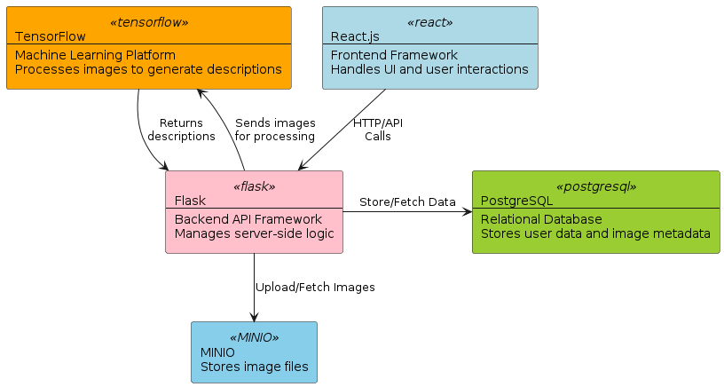
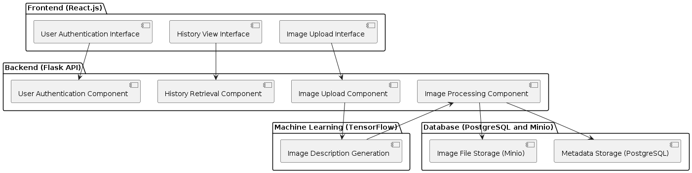

# AccessiWeb
This project aims to develop a web application that enables users to upload images and receive 
descriptions generated by a TensorFlow model.
 
The system will facilitate image processing through integration with TensorFlow, ensuring efficient 
storage and retrieval of data using PostgreSQL for metadata and MinIO for image storage.

----
## Demo
- [Live Demo](https://youtu.be/qCFeIX7077s)

---
## Tech Stack

**Frontend:** FE-TODO

**Backend:** Python, Flask, TensorFlow

**Database:** PostgreSQL

**Storage:** MinIO

**Machine Learning:** TensorFlow, VGG16

**Deployment:** Docker, Docker Compose

----
## Running the Project
### running with docker
#### Prerequisites
- Docker
  - [Windows](https://docs.docker.com/desktop/install/windows-install/) 
- Docker Compose
  - [Windows](https://docs.docker.com/compose/install/)

#### Steps
1. Clone the repository
2. download the model, features and tokenizer from the [drive-link - download all files](https://drive.google.com/drive/folders/1Zt0eDsQXgxeKcCxecVh4s1SRcory2EEg?usp=sharing)  and place them in the machine-learning folder
3. Run `docker-compose up --build` to build the images and start the containers **_(Note: this will take some time based on your internet speed and system capabilities)_**
   - on th first time you run this command, it will take some time(up to 30 min) to download the required images and set up the environment
   - the backend uses tensorflow serving to serve the model, so it will take some time to download Tenserflow, but don't worry, it will only happen once and docker will take care of it
   - after everything is set up, you will see the logs of the containers in the terminal, the backend server will not be directly accessible, as it will take some time to load the model
     - you can check the status of the backend server by running `docker logs accessiweb_flask` in another terminal or it you can see it in the running logs of the build, you will see the logs from TensorFlow model loading
     - once the model is loaded, you will see the url of the backend server in the logs and message that the server is ready to accept requests
     - at this point, you can start using the application
4. Access the frontend at `http://localhost:3000`
5. Access the backend at `http://localhost:5000`
6. Access MinIO at `http://localhost:9000` (credentials: env variables in `docker-compose.yml`)
7. Access PostgreSQL at `http://localhost:5432` (credentials: env variables in `docker-compose.yml`)
---
### running without docker (not recommended)
#### Prerequisites
- Python 3.8
- pip
- Flask
- Node.js
- npm
- PostgreSQL
- MinIO
- TensorFlow

#### Steps
1. Clone the repository
2. run postgres and make sure it's accessible
3. run minio and make sure it's accessible
4. set the required environment variables in a `.env` file in the backend folder (refer to docker-compose.yml for the required variables)
3. download the model, features and tokenizer from the drive-link and place them in the machine-learning folder
3. Run `pip install -r requirements.txt` to install the required python packages inside the backend folder
5. Run `python app.py` to start the backend server
6. Run `npm install` to install the required node packages inside the frontend folder
7. Run `npm run build` to build the frontend
8. Run `npm start` to start the frontend server
---
### Environment Variables
the application uses environment variables to configure the backend server, the following variables are required:
- SECRET_KEY: a secret key for the flask app
- DATABASE_URL: the url of the postgres database
- MINIO_ACCESS_KEY: the access key for minio
- MINIO_SECRET_KEY: the secret key for minio
- MINIO_URL: the url of minio
- MINIO_BUCKET: the bucket name in minio
---
## Features
- Upload images
- Get descriptions for images
- list all images/history
- login/logout, signup, profile
----
## Documentation

### Architecture Overview



#### Frontend (React.js)
- Provides an interface for image upload, history viewing, and user authentication.

#### Backend (Flask API)
- Offers RESTful API endpoints for image processing, user authentication, and data retrieval.
#### Storage
- **PostgreSQL**: Stores metadata.
- **MinIO**: Stores image files for efficient and scalable storage.

#### TensorFlow Model Integration
- Processes images and generates descriptive text.

#### Model
- **Dataset**: Flickr_30k Image Dataset is used to train the model.

#### Deployment
- **Docker**: Used to deploy the application.


----
### Frontend (FE-TODO)


---
### Backend
- The backend is a Flask API that provides RESTful endpoints for image processing, user authentication, and data retrieval. The API is secured using session-based authentication. 
- The backend uses TensorFlow Serving to integrate the TensorFlow model for image processing.
- The backend uses PostgreSQL to store user data and image metadata.
- The backend uses MinIO to store image files for efficient and scalable storage.

#### API Reference
**_- Note: a postman collection is provided in ./backend/AccessiWeb.postman_collection.json**_

##### Register a new user

```http
  POST /register
```

| Parameter  | Type     | Description                               |
| :--------- | :------- | :---------------------------------------- |
| `username` | `string` | **Required**. Username of the new user    |
| `email`    | `string` | **Required**. Email of the new user       |
| `password` | `string` | **Required**. Password of the new user    |

##### Login

```http
  POST /login
```

| Parameter  | Type     | Description                        |
| :--------- | :------- | :--------------------------------- |
| `email`    | `string` | **Required**. Email of the user    |
| `password` | `string` | **Required**. Password of the user |

##### Logout

```http
  POST /logout
```

| Parameter  | Type     | Description                |
| :--------- | :------- | :------------------------- |
| `None`     | `N/A`    | No parameters required     |

##### Upload an image

```http
  POST /upload
```

| Parameter | Type      | Description                      |
| :-------- | :-------- | :------------------------------- |
| `image`   | `file`    | **Required**. Image file to upload|

##### Get upload history

```http
  GET /history
```

| Parameter | Type      | Description                |
| :-------- | :-------- | :------------------------- |
| `None`    | `N/A`     | No parameters required     |

##### Get an image

```http
  GET /get-image
```

| Parameter    | Type     | Description                      |
| :----------- | :------- | :------------------------------- |
| `image_name` | `string` | **Required**. Name of the image to fetch |

##### Get user profile

```http
  GET /profile
```

| Parameter | Type      | Description                |
| :-------- | :-------- | :------------------------- |
| `None`    | `N/A`     | No parameters required     |

---
### Machine Learning (ML-TODO)
#### DataSet 
https://www.kaggle.com/datasets/hsankesara/flickr-image-dataset
#### Model Link
https://drive.google.com/drive/folders/1Zt0eDsQXgxeKcCxecVh4s1SRcory2EEg?usp=sharing

---

## 🔗 Team Members
- [Ahmed Hobeishy](https://www.linkedin.com/in/ahmedhobeishy/)
- (FE-TODO)
- [Chowdhury Abida Anjum Era](https://www.linkedin.com/in/chowdhury-abida-anjum-era/)

----
## Acknowledgements
- [The blog post we based our solution on](https://medium.com/@khaledeemam/a-step-by-step-guide-to-building-an-image-caption-generator-using-tensorflow-a9e0a87cc0cb)

