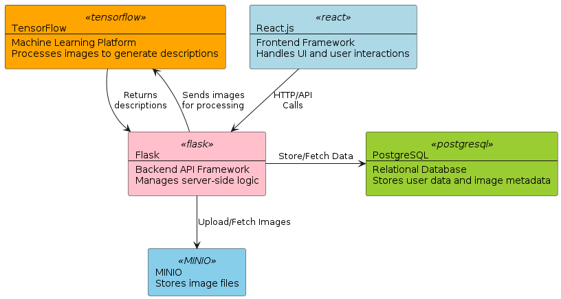
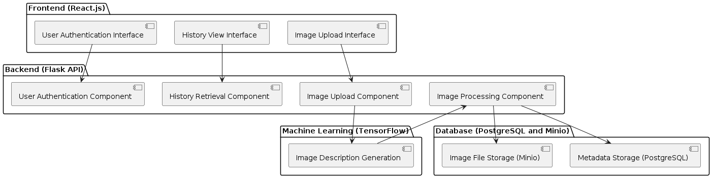

# AccessiWeb

A web application that enables users to upload images and receive AI-generated descriptions powered by a TensorFlow image captioning model. The system integrates TensorFlow Serving for model inference, PostgreSQL for metadata storage, and MinIO for scalable image storage.

---

## Table of Contents

- [Demo](#demo)
- [Features](#features)
- [Architecture Overview](#architecture-overview)
- [Tech Stack](#tech-stack)
- [Documentation](#documentation)
- [Running the Project](#running-the-project)

---

## Demo

[Video Demo](https://youtu.be/qCFeIX7077s)

---

## Features

- Upload images and receive AI-generated descriptions
- View upload history
- User authentication (register, login, logout, profile)

---

## Architecture Overview

The system is composed of four main layers:

- **Frontend (React)** — handles image upload, history viewing, and user authentication
- **Backend (Flask API)** — exposes RESTful endpoints for image processing, authentication, and data retrieval, secured with session-based authentication
- **Storage** — PostgreSQL for user data and image metadata, MinIO for scalable image file storage
- **ML Model (TensorFlow Serving)** — processes uploaded images and generates descriptive captions

---

## Tech Stack

| Layer | Technology |
|---|---|
| Frontend | React, TypeScript, Tailwind CSS, Material UI |
| Backend | Python, Flask |
| Machine Learning | TensorFlow, Keras, VGG16 |
| Database | PostgreSQL |
| Storage | MinIO |
| Deployment | Docker, Docker Compose |

---

## Documentation

### Machine Learning

The model is based on **VGG16** (pre-trained) for image feature extraction, combined with a text generation head trained on the **Flickr 30k dataset**.

- **Dataset:** [Flickr 30k on Kaggle](https://www.kaggle.com/datasets/hsankesara/flickr-image-dataset)
- **Trained Model:** [Download from Google Drive](https://drive.google.com/drive/folders/1Zt0eDsQXgxeKcCxecVh4s1SRcory2EEg?usp=sharing)
- Split ratio: 90% training / 5% validation / 5% test
- 50 epochs with data shuffling per epoch to reduce overfitting
- Evaluated using **BLEU score** (Bilingual Evaluation Understudy)
- Uses TensorFlow's `TextVectorization` layer and Keras API

---

### Backend API

> A Postman collection is available at `./backend/AccessiWeb.postman_collection.json`

| Method | Endpoint | Description |
|---|---|---|
| POST | `/register` | Register a new user |
| POST | `/login` | Log in |
| POST | `/logout` | Log out |
| POST | `/upload` | Upload an image and get a description |
| GET | `/history` | Get upload history |
| GET | `/get-image` | Fetch a specific image by name |
| GET | `/profile` | Get user profile |

---

### Frontend

- Built with React and TypeScript for type safety
- Responsive UI using Tailwind CSS and Material UI
- Image upload managed with React Dropzone

---

## Running the Project

### With Docker (Recommended)

#### Prerequisites

- Docker
- Docker Compose

#### Steps

1. Clone the repository
2. Download the model, features, and tokenizer from the [Google Drive link](https://drive.google.com/drive/folders/1Zt0eDsQXgxeKcCxecVh4s1SRcory2EEg?usp=sharing) and place them in the `machine-learning` folder
3. Run `docker-compose up --build`
   - The first run may take up to 30 minutes to download images and set up the environment
   - The backend will not be immediately accessible — TensorFlow Serving needs time to load the model
   - Monitor readiness with `docker logs accessiweb_flask`; the server is ready when you see the startup message
4. Access the services:
   - Frontend: `http://localhost:3000`
   - Backend: `http://localhost:5000`
   - MinIO: `http://localhost:9000`
   - PostgreSQL: `http://localhost:5432`

> **Note:** If you encounter `./entrypoint.sh no such file or directory`, see [this fix](https://stackoverflow.com/questions/44460825/entrypoint-file-not-found) — it's typically a line endings issue on Windows.

---

### Without Docker

#### Prerequisites

- Python 3.8, pip
- Node.js, npm
- PostgreSQL
- MinIO
- TensorFlow

#### Steps

1. Clone the repository
2. Start PostgreSQL and MinIO and ensure they are accessible
3. Create a `.env` file in the `backend` folder using the variables from `docker-compose.yml` as reference
4. Download the model files into the `machine-learning` folder
5. In the `backend` folder: `pip install -r requirements.txt` then `python app.py`
6. In the `frontend` folder: `npm install` then `npm run build` then `npm start`

#### Environment Variables

| Variable | Description |
|---|---|
| `SECRET_KEY` | Flask secret key |
| `DATABASE_URL` | PostgreSQL connection URL |
| `MINIO_ACCESS_KEY` | MinIO access key |
| `MINIO_SECRET_KEY` | MinIO secret key |
| `MINIO_URL` | MinIO URL |
| `MINIO_BUCKET` | MinIO bucket name |
